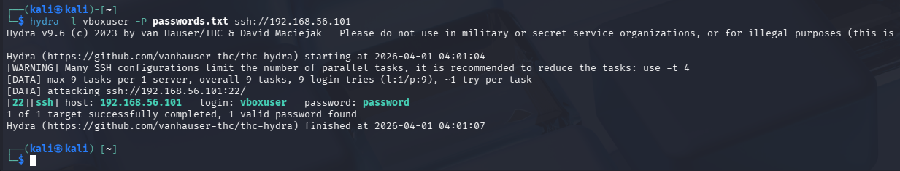
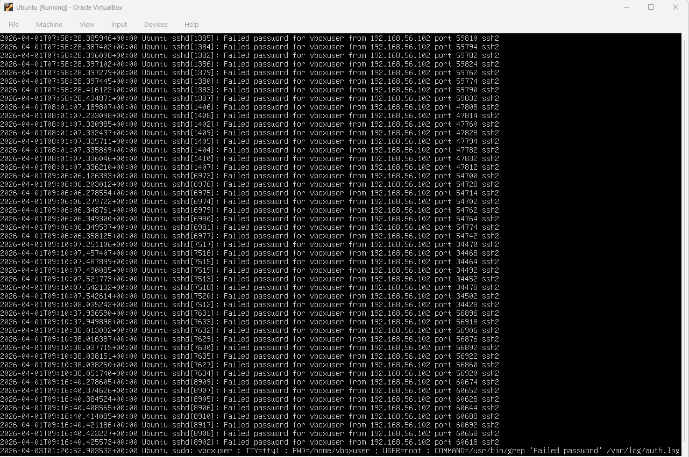
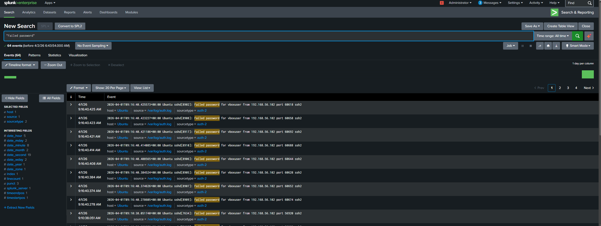
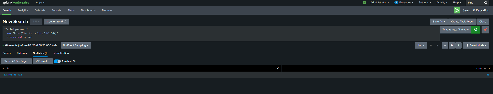
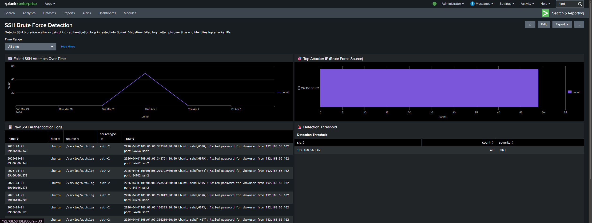
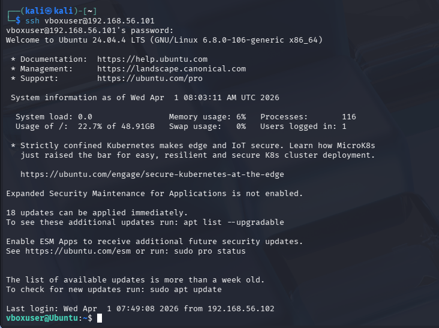
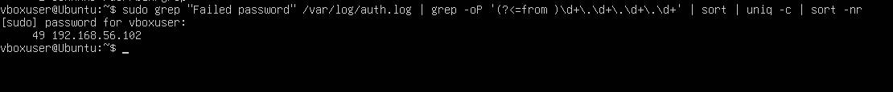

# 🛡️ SSH Brute-Force Detection Lab (Splunk)

## 📌 Overview

This project simulates an SSH brute-force attack and demonstrates detection using Splunk SIEM and Linux log analysis.

---

## 🧱 Lab Setup

* Attacker: Kali Linux
* Target: Ubuntu
* SIEM: Splunk
* Network: Host-only adapter

---

## ⚔️ Attack Simulation

A brute-force attack was performed using Hydra against an SSH service.

```bash
hydra -l vboxuser -P passwords.txt ssh://192.168.56.101
```

### 🔥 Hydra Attack



---

## 📊 Log Evidence (Linux)

Authentication logs show repeated failed login attempts:

```bash
grep "Failed password" /var/log/auth.log
```

### 📄 Raw Log Evidence



---

## 🔍 Detection in Splunk

Failed login attempts were ingested into Splunk and analyzed.

### 🚨 Failed Login Events



---

### 📈 Attack Source Identification

```spl
"Failed password"
| rex "from (?<src>\d+\.\d+\.\d+\.\d+)"
| stats count by src
| where count > 5
```

### 📊 Failed Attempts by IP



---

## 📊 Splunk Dashboard

This dashboard visualizes SSH brute-force attack activity using ingested Linux authentication logs.

### 🔹 Features
- Failed SSH attempts over time
- Top attacker IP identification
- Raw authentication logs
- Detection threshold for suspicious activity

### 🖼️ Dashboard Preview



---

## 🔎 Key Splunk Queries

### Failed SSH Attempts
index=main source="/var/log/auth.log" "Failed password"

### Top Attacker IP
index=main source="/var/log/auth.log" "Failed password"
| rex "from (?<src>\d+\.\d+\.\d+\.\d+)"
| stats count by src
| sort -count

### Detection Threshold
index=main source="/var/log/auth.log" "Failed password"
| rex "from (?<src>\d+\.\d+\.\d+\.\d+)"
| stats count by src
| where count > 10

---

## Alerting & Detection

Configured a Splunk alert to detect SSH brute-force activity:
- Trigger: Failed login attempts > threshold
- Severity: High
- Result: Alert successfully triggered during simulated attack

screenshots/alert-triggered.png

---

## 🎯 Successful Compromise

After multiple attempts, the attacker successfully logged in:

### 🔓 SSH Access Gained



---

## 🧠 Advanced Log Parsing (Linux)

Improved log parsing using regex to accurately extract attacker IPs:

### 🧩 IP Extraction



---

## 🚨 Findings

* Attacker IP: **192.168.56.102**
* Total failed attempts: **49**
* Successful login confirmed
* Pattern consistent with brute-force attack

---

## 💡 Key Takeaways

* Brute-force attacks generate identifiable patterns in logs
* SIEM tools like Splunk enable centralized detection
* Combining Linux and SIEM analysis improves visibility
* Accurate parsing (regex) is critical for reliable detection

---

## 🛠️ Skills Demonstrated

- Log analysis (Linux authentication logs)
- SIEM usage (Splunk Enterprise)
- Threat detection (SSH brute-force)
- Regex field extraction
- Data visualization (Splunk dashboards)
- Basic detection engineering (threshold-based alerting)

---

## 🚨 Future Improvements

- Implement real-time alerts in Splunk
- Simulate multiple attackers
- Integrate with SOAR tools for automated response

---

## 🧠 Conclusion

This project demonstrates the ability to detect and investigate SSH brute-force attacks using Splunk. By ingesting Linux authentication logs, extracting attacker IPs, and applying threshold-based detection logic, this lab simulates real-world SOC analyst workflows including monitoring, detection, and initial triage.
